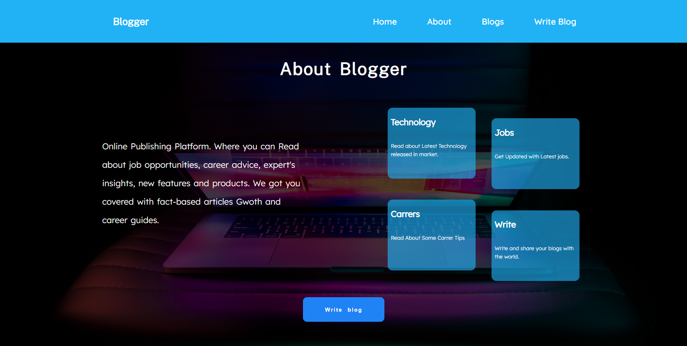
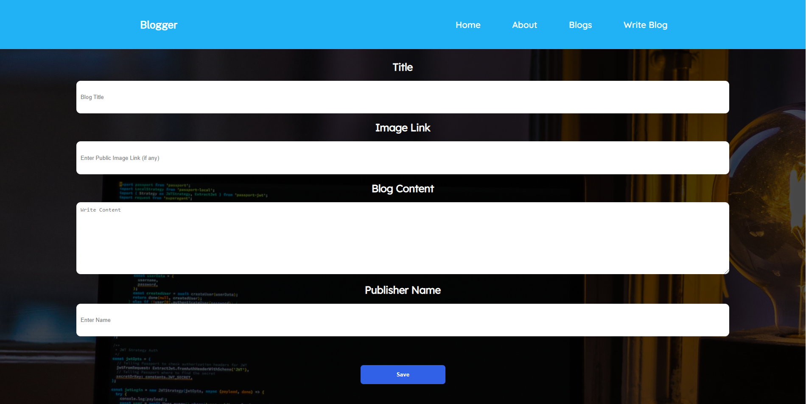
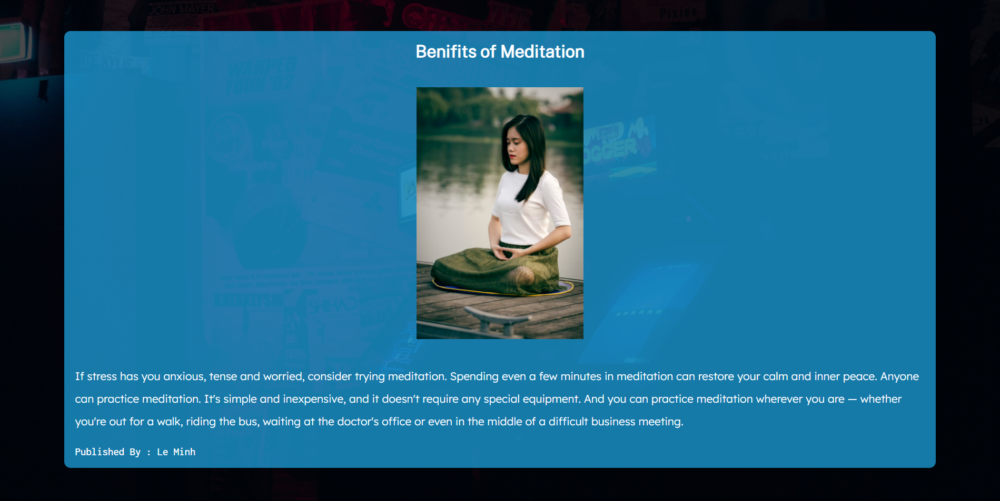

# Blog Website

Blog Website Where user can write blog and Publish it Publically

Tech Stack used for creation of blog Website
* HTML
* CSS
* JavaScript
* EJS
* NodeJS
* ExpressJS 
* MongoDB 
* GitHub

# Screenshots

<br>

# Home Page


<br>
<br>

# About Page



<br>
<br>

# Blog Page


<br>
<br>

# Write Blog Page



<br>
<br>

# Read Blog Page



<br>
<br>

# Footer


<br>
<br>

# Run this Website Locally
<br>

Clone the repository 

```shell
git clone https://github.com/0xdevsachin/CA-3.git
 ```
Install dependencies. Make sure you have `nodejs` already installed in your system
```shell 
npm install 
```
After  Installing dependencies run the Web Application
```shell
npm start
```
If you follow every step correctly website will be live at localhost port 3300

<br>

## Blog Website is live at

[Live Link](https://sachin-blogger-website-ca3.herokuapp.com/) 
